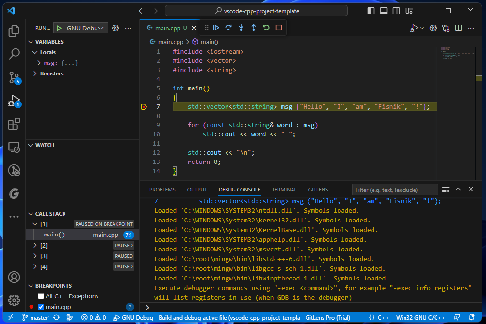

# C/C++ Project Template for Visual Studio Code
A ready to use project template for C/C++ programmers. 

## Motivation
There are plenty of tutorials on how to go about setting up the VS Code Editor for C/C++ development. However, in most cases, a hands-on readily available boilerplate rather exists, hence why this repository was made. 

### Configurations
* Windows MS Build (cl.exe)
* Windows GNU Build (g++.exe)
* MAC Clang Build (clang++)
* Linux GNU Build (g++)

> **Note**: Includes `launch.json` for building and debugging. Includes also the `c_cpp_properties.json` for each platform and environment. 

> **Warning**: This has not been tested under MAC or Linux at this point. 

### Example
